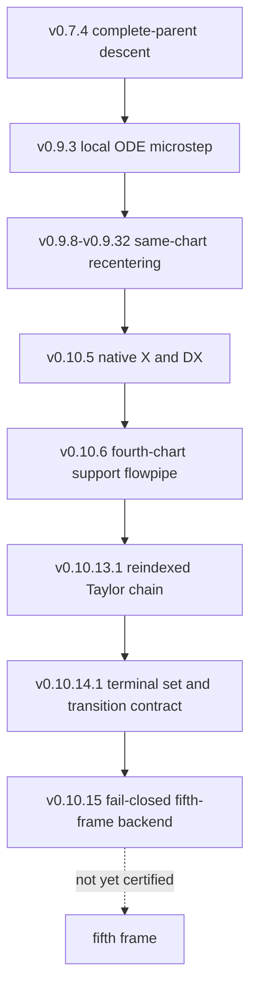

# Proof Graph

The repository currently has three proof layers.

## Layer I: Unconditional Local Theorem

`v0.7.4 -> v0.9.2 -> v0.9.3`

- v0.7.4 certifies complete-parent-box rank, tangency, nonstationarity, and
  strict descent.
- v0.9.2 supplies the centered mean-value Krawczyk construction.
- v0.9.3 proves the local intrinsic ODE microstep: existence, uniqueness,
  exact preservation of the declared \(\mathcal R_3\), and strict \(L_6\)
  descent.

This is the theorem-bearing reference layer.

## Layer II: Frozen-Instance Finite Continuation

`v0.9.8 ... v0.10.6`

- The chain recenters through second, third, and fourth local charts for the
  frozen chart-9/child-15 instance.
- v0.10.5 certifies repository-native `X` and same-expression `DX`.
- v0.10.6 is the latest stored reference certificate: ten fourth-chart Lohner
  support-flowpipe steps inside the declared real and complex domains.

This layer is finite and local. It does not prove complete-child traversal or a
global flow.

## Layer III: Conditional / Next-Frame Continuation Work

`v0.10.13.1 -> v0.10.14.1 -> v0.10.15`

- v0.10.13.1 source certifies the reindexed Taylor/affine-Lohner chain when
  predecessor artifacts are present.
- v0.10.14.1 freezes the terminal correlated set and emits the nonlinear
  fourth-to-fifth transition contract.
- v0.10.15 is a fail-closed harness. It becomes theorem-bearing only after
  native Arb callbacks produce a certificate that passes all formal gates.

This layer prepares the fifth-frame proof. It does not replace the missing
fifth-frame certificate for the frozen numerical instance.

